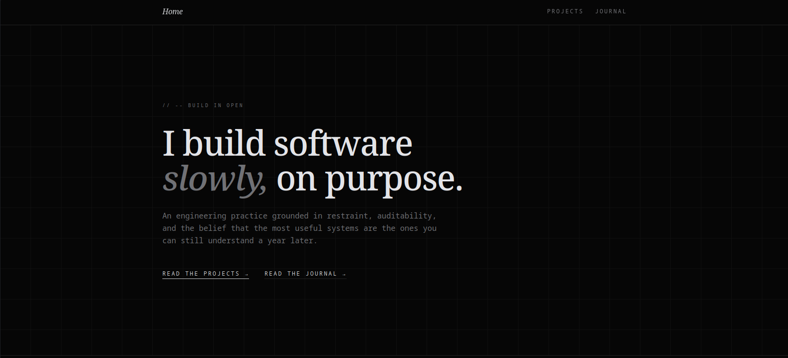
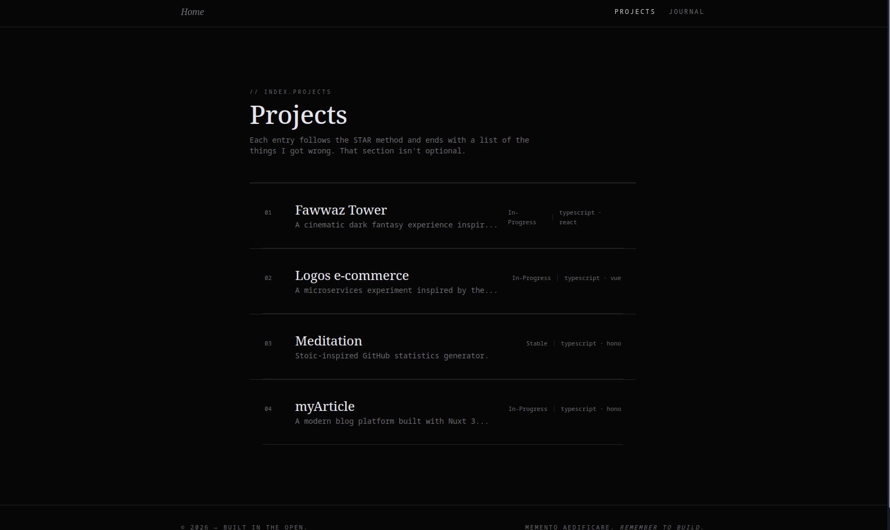
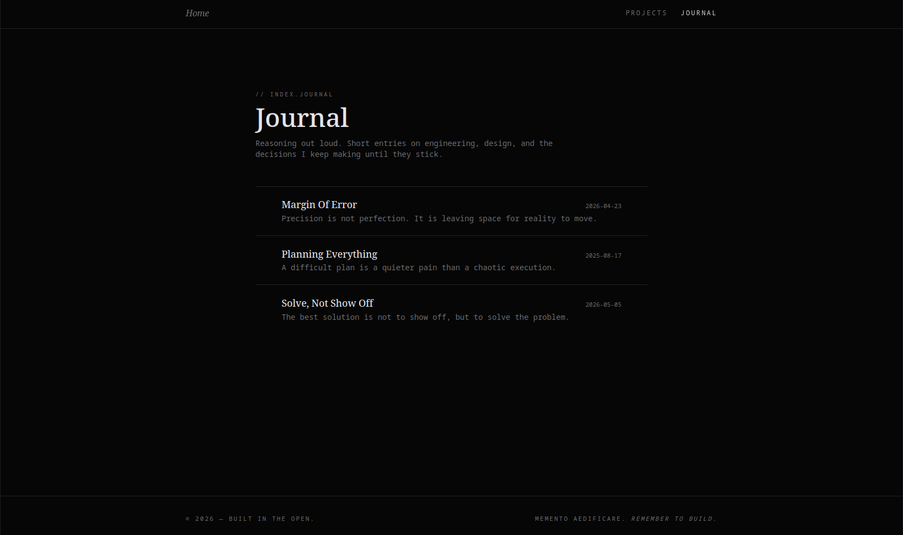

# github-page

> _A living archive. Not a portfolio — a record of what broke, what was learned, and what changed because of it._

Documentation is not the end product. It is the process made visible.

---

## Philosophy

Most platforms document success. This one documents the path — including the wrong turns.

Three principles govern everything here:

**Honesty** — If something failed, it is written as a failure. Not a "learning opportunity." A failure.

**Transparency** — The reasoning behind decisions is preserved alongside the decisions themselves. Future readers deserve context, not just conclusions.

**Minimalism** — Nothing is added without purpose. Complexity earns its place or is removed.

---

## The Project

### Motivation

Most developers carry a graveyard of failed experiments, abandoned ideas, and half-understood concepts. They are rarely documented. The lesson disappears with the terminal session.

This project exists because failure is data. An undocumented failure is a lesson paid for and then lost.

### What It Solves

Technical writing on the internet optimizes for authority — polished posts, confident conclusions, no visible uncertainty. That format actively discourages honesty about the learning process.

`github-page` solves a different problem: _how do you build a permanent, structured record of your actual technical journey_ — including the parts that did not go as planned?

It gives a dedicated place for:

- Failures documented at the moment they happen, not cleaned up in retrospect
- Decisions explained with the reasoning that existed _at the time_, not the reasoning that seems obvious after the fact
- A learning path that is traceable — where you started, where you are, what changed

### How It Works

The project is a statically generated site built on Astro. Content lives as Markdown files in `src/content/` — one file per article, reflection, or failure log. Astro compiles everything to static HTML at build time.

There is no database. No CMS. No dynamic server.

The writing is the architecture. Everything else is infrastructure that stays out of the way.

---

## What This Is

It is not a blog. It is not a portfolio. It is a record.

---

## Screenshots

### Home



> Entry point. Articles listed in reverse chronological order — most recent failure first.

---

### Projects View



> Clean reading surface. No sidebar. No recommendations. One piece of writing, full attention.

---

### Journal



> Full index of all entries. Filterable by tag. Searchable by title. (planned)

---

---

## Tech Stack

| Layer    | Technology    | Reason                                  |
| -------- | ------------- | --------------------------------------- |
| Frontend | Astro         | Zero JS by default. Content first.      |
| Styling  | Tailwind CSS  | Utility-first. No abstraction overhead. |
| Runtime  | Bun / Node.js | Fast iteration, minimal setup.          |

---

## Project Structure

```
.
├── src/
│   ├── components/     # Reusable UI primitives
│   ├── pages/          # Route-based page components
│   ├── content/        # Articles, reflections, failure logs
│   └── layouts/        # Structural page templates
├── public/
│   └── screenshots/    # UI screenshots for documentation
└── README.md
```

The `content/` directory is the core of this project. Everything else exists to serve it.

---

## Getting Started

**Prerequisites**

- Node.js v18+
- `npm` or `bun`

**Install and run**

```bash
git clone https://github.com/fawwaz/github-page.git
cd github-page

bun install        # or: npm install
bun dev            # or: npm run dev
```

**Build**

```bash
bun run build      # or: npm run build
```

---

## Features

| Status | Feature                        |
| ------ | ------------------------------ |
| ✓      | Technical failure archive      |
| ✓      | Self-reflection writing format |
| ✓      | Learning path documentation    |
| ○      | Search and tagging             |
| ○      | RSS feed                       |

`✓` shipped — `○` planned

---

## Contributing

This is a personal archive. It is not open to contributions in the traditional sense.

If something is wrong — factually, technically — open an issue. Corrections are welcome. Opinions are not.

---

## License

MIT. Use freely. Attribution appreciated, not required.

---

_Muhammad Fawwaz Almumtaz_  
_Built to document the process, not perform the result._
